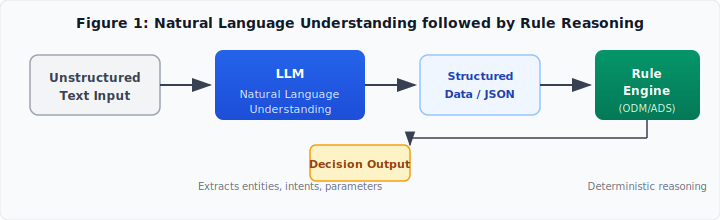
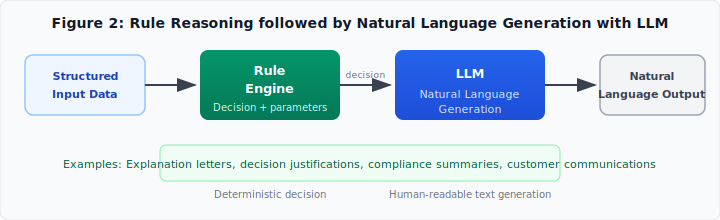
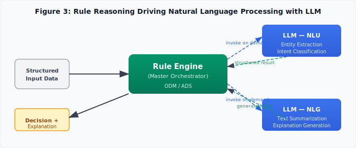
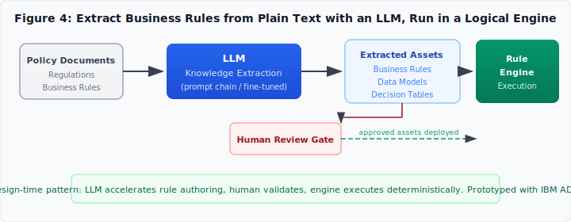
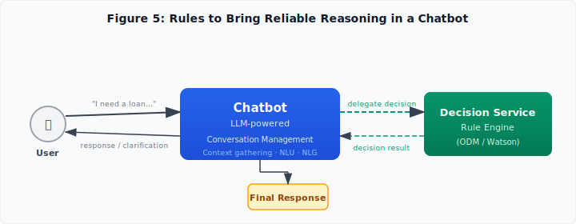
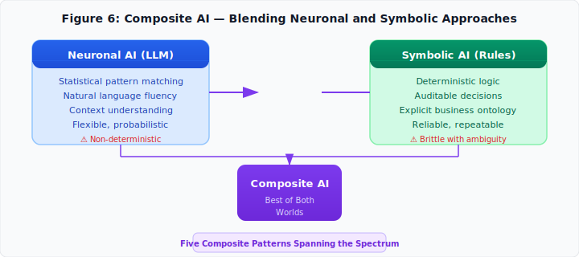

Enterprise decision automation sits at an uncomfortable intersection. Large Language Models promise natural interaction and flexibility. Business decisions demand auditability, determinism, and compliance with regulations that do not negotiate. The question is not which technology wins. The question is how to combine them — and the answer has roots going back nearly half a century.

Pierre Feillet, Allen Chan, Luigi Pichett, and Yazan Obeidi addressed this in their 2023 article [*Approaches in Using Generative AI for Business Automation*](https://medium.com/@pierrefeillet/approaches-in-using-generative-ai-for-business-automation-the-path-to-comprehensive-decision-3dd91c57e38f), proposing five architectural patterns blending LLMs with rule-based decision engines. In 2026, Feillet followed up with [*Rule Engines Never Died — They're Running Alongside Your Large Reasoning Models*](https://medium.com/@pierrefeillet/rule-engines-never-died-theyre-running-alongside-your-lrm-6f39cad6e1d3), tracing a 40-year arc from Charles Forgy's RETE algorithm to the Model Context Protocol. Meanwhile, a sustained research program at KU Leuven, led by Jan Vanthienen and Alexandre Goossens, has been systematically attacking the problem from the academic side — building deep learning pipelines to extract DMN decision models from text, generating chatbots from decision models, and mapping the landscape of automated decision model acquisition.

This essay weaves these threads together, beginning where the story begins.

## The RETE algorithm (1979)

In 1979, Charles L. Forgy, a PhD student at Carnegie Mellon University, solved a problem that would shape the next four decades of enterprise computing. Given a large set of IF-THEN rules and a working memory full of facts, how do you efficiently determine which rules should fire?

The naive approach — test every rule against every fact on every cycle — is catastrophically slow. Ten thousand rules against a hundred thousand facts is a billion comparisons per cycle. Production systems in the 1970s ground to a halt under realistic workloads.

Forgy's insight was that working memory changes slowly between cycles. Typically only a few facts are added or removed at each step. Re-evaluating every rule from scratch means repeating vast amounts of work that has not changed. What if you could *remember* partial matches and only recompute what actually changed?

The result was the RETE algorithm — Latin for "net" — published in Forgy's 1979 PhD thesis and in a landmark 1982 paper in *Artificial Intelligence*: [*Rete: A Fast Algorithm for the Many Pattern/Many Object Pattern Match Problem*](https://doi.org/10.1016/0004-3702(82)90020-0).

### How it works

RETE has two phases. **Compilation:** rules are compiled into a discrimination network — a directed acyclic graph where each node tests a condition. Conditions appearing in multiple rules are compiled once and shared. If twenty rules check `customer.tier == "premium"`, there is one node, not twenty. **Runtime:** facts enter at the root and propagate. Each node caches the facts that satisfy its condition. When a fact changes, only affected branches re-evaluate. The algorithm trades memory for speed — storing partial match state at every node — and achieves performance that is, in Forgy's words, theoretically independent of the number of rules.

### The lineage

RETE became the core of **OPS5**, which powered **R1/XCON** — an expert system that configured VAX computer orders for Digital Equipment Corporation, one of the first commercially successful AI systems. It went on to become the backbone of production rule systems across the industry: **CLIPS** (NASA), **Jess** (Java), **Drools** (open-source, now Apache), **IBM Operational Decision Manager**, **Soar**, **Blaze Advisor**, and **TIBCO BusinessEvents**. Banks used it for loan origination. Insurers for claims adjudication. Governments for eligibility determination. The RETE network was invisible infrastructure, humming inside systems that made consequential decisions about people's money, health, and legal status.

And then, around 2022, the world became captivated by a different kind of AI. The question became: are rule engines obsolete?

Feillet's 2026 answer is unequivocal: no. They never died. They are running alongside your LLM right now.

Modern rule engines have also evolved beyond RETE. **[RuleGo](https://github.com/rulego/rulego)** — an open-source rule engine in Go (Apache 2.0) — uses a Directed Acyclic Graph rather than a discrimination network. Business logic is composed of component nodes wired into rule chains; messages flow along predetermined paths. This trades RETE's expressive forward-chaining for deterministic execution with extremely low resource consumption — ~19 MB of memory under 500 concurrent requests on a Raspberry Pi 2. Both RETE-based and DAG-based engines have their place, and both are finding their way into composite AI architectures.

## Rule engines never died: from RETE to MCP

Feillet's 2026 article traces a 40-year arc and argues that the most important trend is not replacement but convergence.

### Two ways to answer the same question

Both rule engines and Large Reasoning Models address the identical problem: given what we know, what should we conclude? The methods differ. The objective is the same.

Rule engines separate knowledge from execution. Business logic is declarative (IF/THEN). The inference engine evaluates which rules are satisfied. When multiple rules fire, a conflict resolution mechanism — the *agenda* — determines firing order. Every inference step is explicit. An auditor can trace precisely which rule fired, what triggered it, and why. Rule engines produce *proofs*.

LRMs store knowledge as distributed numerical representations learned across billions of examples. Their reasoning is what Feillet calls "an approximation of modus ponens" executed through statistical pattern completion. The power is flexibility and cross-domain generalization. The fragility is hallucination — producing plausible-sounding but logically invalid conclusions because, as Feillet puts it, "plausibility and logical validity are different things."

The core distinction: **rule engines guarantee correctness relative to their rules; LRMs generate probabilistically plausible conclusions.** One yields proofs, the other rationales. Both are useful. Confusing them is dangerous.

### The hybrid inference loop

Modern reasoning models can delegate to deterministic execution — generating and executing Python code when precision is needed, feeding the exact result back into context. The Model Context Protocol formalizes this as a loop:

1. Reason with available context
2. Identify what is uncertain
3. Delegate to a tool
4. Receive facts
5. Continue reasoning

Feillet draws a structural parallel to production rule systems invoking external actions — except orchestration is now performed by a neural model rather than a symbolic agenda. IBM ODM and Decision Intelligence expose decision services via MCP, enabling a reasoning model to invoke a full rule engine at the precise point where governed, deterministic decisions are needed. The LRM handles interpretation and context; the rule engine handles logic requiring correctness and traceability.

### Converging trends

Feillet identifies three: rule engines incorporating generative AI for authoring and explanation (Patterns 2 and 4 from the 2023 taxonomy); reasoning models incorporating deterministic subsystems to ground outputs; and hybrid inference architectures where stochastic reasoning delegates to symbolic reasoning at the moments that matter.

### RuleGo: the convergence in a Go library

The convergence is not confined to enterprise platforms. **[RuleGo](https://github.com/rulego/rulego)** is a modern rule engine that already embodies the hybrid architecture. Its DAG-based component model treats an LLM call as just another node in the rule chain graph — a filter, a transformer, an HTTP push, an LLM intent extractor, all share the same interface. The **[rulego-components-ai](https://github.com/rulego/rulego-components-ai)** extension provides LLM integration and MCP server/client support. A RuleGo instance can expose its rule chains as MCP tools, making them discoverable by an LLM-based reasoning model. Conversely, RuleGo can act as an MCP client, calling out to LLM endpoints when rule chain logic requires it. The hybrid inference loop Feillet describes — reason, identify uncertainty, delegate, receive, continue — is directly implementable as a RuleGo rule chain alternating between deterministic component nodes and MCP-mediated LLM calls.

The significance is not that RuleGo replaces IBM ODM. It is that the composite AI pattern has become general enough to appear in a Go library running on a Raspberry Pi. The 40-year arc from RETE to MCP passes through `go get github.com/rulego/rulego`.

## Finite state machines vs. rule engines

Before discussing composite AI patterns, there is an architectural distinction worth making explicit: the difference between finite state machines and rule engines, and why confusing them leads to brittle systems.

A **finite state machine** answers the question *what happens next?* It encodes a fixed set of states and explicit transitions between them. You are in state S. Event E arrives. If a transition from S on E is defined, you move to the target state. The FSM knows where you are, what you can do, and where you go next. Its logic is procedural: the sequence matters, the state matters, the transition guard matters.

A **rule engine** answers the question *what should we conclude?* It encodes condition-action pairs evaluated against a working memory of facts. Any rule whose conditions are satisfied is eligible to fire. The rule engine does not care about sequence — it cares about satisfaction. Its logic is declarative: the facts matter, the conditions matter, the conclusions matter. Order of rule evaluation is the engine's concern, not the author's.

The distinction is sharp:

| Dimension | FSM | Rule Engine |
|---|---|---|
| Core question | What happens next? | What should we conclude? |
| Logic style | Procedural | Declarative |
| State model | Explicit states + transitions | Working memory of facts |
| Control flow | Defined by transition graph | Defined by rule firing (agenda) |
| Best for | Workflows, protocols, pipelines | Policies, decisions, classifications |
| Determinism | Deterministic given state + event | Deterministic given rule set + facts |
| Complexity grows with | Number of states × transitions | Number of rules × fact combinations |

The mistake is using one where the other belongs. Encoding a loan eligibility policy as an FSM produces an explosion of states — one for every combination of credit score band, debt ratio, collateral type, and regulatory jurisdiction. Encoding a multi-step claims workflow as a flat rule set produces fragile priority chains (`rule-1: if step=pending_review then...`) where the implicit process state is smuggled through working memory facts. Each approach can express the other's domain, but the expression is awkward, verbose, and hard to maintain.

The rule of thumb: if the problem is *procedural* — steps, stages, sequences, approvals, handoffs — reach for an FSM or a workflow engine. If the problem is *decisional* — eligibility, pricing, risk, compliance, classification — reach for a rule engine. Most real business processes are both.

## What an enterprise decision requires

Before discussing architectures, Feillet's 2023 article enumerates eight criteria. They explain why the LLM-only approach keeps hitting a wall.

1. **Accuracy.** A loan decision wrong 2% of the time is not 98% accurate — it is a regulatory finding and a lawsuit. Correctness means *every time*.
2. **Scalability.** Millions of claims per day cannot degrade when the rule base grows to tens of thousands of rules. RETE's performance-independence from rule count matters here.
3. **Adaptability.** Regulations and policies change. The system must accommodate new rules without a multi-month DevOps cycle.
4. **Latency.** Budgets vary — milliseconds for fraud, seconds for pre-approval, minutes for underwriting — but must be predictable. LLM latency is variable; rule engine latency is not.
5. **Auditability.** "The model's attention weights converged on that outcome" is not an acceptable answer to a regulator. Rule engines produce proofs, not rationales.
6. **Privacy.** Enterprise decisions involve PII, financial data, and health records. Sending sensitive data to a third-party LLM API is often not an option.
7. **Monitoring.** Decision volumes, rule firing frequencies, exception rates, and performance trends are operational requirements, not afterthoughts.
8. **Cost.** LLM inference at scale is expensive. Rule engine execution is cheap. The composite system's cost profile varies dramatically by pattern.

## Why LLMs alone fail the enterprise test

The 2023 article is direct: LLMs "show impressive results and some reasoning capabilities" yet "fail as easily when repeating the experience." This is not a bug — it is the architecture. LLMs are probability distributions over token sequences. For creative tasks, variation is a feature. For mortgage decisions, it is a liability.

The authors give a concrete example: a pizza ordering bot from DeepLearning.ai's tutorial that "depending on the runs, provides the expected outcome or a surprising one." Wrong pizza toppings are annoying. Wrong loan decisions are lawsuits.

Feillet's 2026 article sharpens the argument: the rule engine guarantees correctness relative to its encoded rules; the LRM generates text that *sounds like* reasoning. In enterprise contexts, you need the first and want the second — which is exactly why you combine them.

## Five patterns for composite AI

The 2023 article's core contribution is a practitioner's taxonomy: five integration patterns, each with defined tradeoffs. They come from experience with IBM ODM and ADS, but the patterns are general. They let an architect reason about *where* in the pipeline the LLM should sit and *what role* it should play.

### Pattern 1: NLU → Rules



An LLM comprehends unstructured text and extracts structured data; a rule engine reasons deterministically on that data. An insurance claim — "I was rear-ended at Main and Oak last Tuesday" — becomes structured fields (`incident_type: rear_end_collision`, `fault_party: other_driver`), which the rule engine processes against policy terms.

Integration is straightforward. The LLM never makes a business decision; the rule engine never parses messy language. The hidden work is schema design: if you ask the LLM to extract `damage_severity` as free text, the rule engine must parse "pretty bad" and "totaled" into actionable categories. If you constrain it to a controlled vocabulary, the LLM must map ambiguous descriptions onto discrete labels. The abstraction leaks at the schema boundary.

### Pattern 2: Rules → NLG



The flow reverses: a rule engine decides on structured data, then an LLM generates natural language. A loan decision (`approved, $350,000, 6.25%`) becomes a customer letter.

This is the most common production pattern and the safest from a compliance perspective — the LLM never influences the decision. The real win is consistency at scale with personalization: every customer gets a correctly structured, deterministic communication whose surface text varies by tone, language, and channel.

The hard problem is testing. The LLM may phrase the same information in dozens of valid ways, so you cannot assert on output strings. You need semantic testing: does the output contain required fields? Does it omit restrictions or deadlines? A Spanish-language denial letter that subtly softens rejection language creates compliance exposure. Constrained generation — not free-form text — is the requirement.

### Pattern 3: Rules orchestrate LLM



The rule engine is the master orchestrator, invoking LLMs on demand for delegated NLP tasks. A claims adjudication flow confirms coverage, verifies liability, then hits a fraud review threshold. The rule engine invokes an LLM: "Summarize inconsistencies in the claim description and three years of claim notes." The LLM returns structured analysis; the rule engine incorporates it and continues.

Costs are proportional to actual need — not every transaction invokes the LLM. The coupling, however, is tight. The rule engine needs orchestration rules: *when* to call, *what prompt* to send, *how to interpret* the response, *what fallback* to use if the LLM returns nonsense. These are not business rules but meta-rules governing the LLM interaction itself.

### Pattern 4: LLM extracts rules



The most ambitious pattern: LLMs at *design time* extract automation assets — business rules, data models, decision tables — from plain-text policy documents. The extracted assets generate an automation project. Rules then execute deterministically, decoupled from the LLM that helped author them.

Policy documents are ground truth. Today, human analysts manually encode them — slow, expensive, error-prone, and creating a synchronization problem when source documents change. An LLM that extracts rules with traceability (each rule links back to its source paragraph) promises dramatically decreased TCO. The article notes this was prototyped with IBM ADS.

The challenges: prompt chains or fine-tuned models, companion tools for validation and synchronization, and a human review gate. The LLM turns weeks of manual rule writing into hours of review, but cannot replace expert judgment. The lifecycle problem — keeping extracted rules in sync with evolving source documents — persists long after initial extraction. This is where the KU Leuven research program enters.

### Pattern 5: Chatbot delegates to rules



An LLM drives the conversation; when a business decision is needed, the chatbot delegates to a rule engine. It recognizes the trigger, gathers parameters across dialogue turns, invokes the engine, and restitutes results through NLG. This is Pattern 1 and Pattern 2 stitched together in a conversational loop.

Two hard problems. **Decision trigger detection:** in open-ended conversation, when has the user crossed from "what are your rates?" to "I'd like to apply"? False positives annoy; false negatives lose business. **Incomplete context:** "my income is around 80K" when the engine needs an exact figure. The chatbot must ask, not fabricate.

The delegation boundary needs a formal contract: the rule engine exposes a decision service with a defined input schema, and the chatbot populates that schema conversationally. This is a form-filling dialogue where the form is the DMN model's input requirements — precisely the framing that Etikala, Goossens, Van Veldhoven, and Vanthienen developed in their 2021 work on generating chatbots from DMN models.

## FSMs with rule engines: process skeleton, decision muscle

The five Feillet patterns describe how to combine LLMs with rule engines. But there is an orthogonal dimension: combining finite state machines with rule engines, with or without an LLM in the loop. This pattern — FSM as process skeleton, rule engine as decision muscle — predates LLMs entirely and remains one of the most underappreciated architectural choices in enterprise systems.

### The pattern

An FSM manages the process lifecycle: which stage the transaction is in, which transitions are valid, what happens on entry and exit to each state. At each state where a decision is required, the FSM delegates to a rule engine. The rule engine receives the accumulated facts — data gathered across prior states, enriched from systems of record, validated by previous transitions — and produces a structured decision. That decision determines the next transition.

Consider a mortgage origination pipeline:

```
[Application] → [Review] → [Underwriting] → [Approval] → [Closing]
                    |            |               |
                    v            v               v
               Rule Engine   Rule Engine    Rule Engine
               (completeness (credit risk,   (final conditions,
                check)        collateral)     compliance)
```

The FSM owns the pipeline. It knows the application moves from Review to Underwriting only after completeness checks pass. It knows Underwriting can transition to Approval (decision: approve), Rejection (decision: deny), or back to Review (decision: need more information). The rule engines own the decisions at each gate. The completeness rule engine checks required fields and document presence. The underwriting rule engine evaluates creditworthiness, debt-to-income ratio, collateral value, and regulatory constraints. The approval rule engine applies final conditions, rate locks, and compliance sign-offs.

### Why this works

Each component does what it is best at. The FSM is procedural — it encodes the *process* that the business designed. The rule engine is declarative — it encodes the *policy* that the business wrote. Separating them means:

**Process changes do not touch policy.** Adding a new "Fraud Check" state between Review and Underwriting requires modifying the FSM transition graph. None of the rule sets change. The fraud check state invokes its own rule engine with fraud-specific rules, but the underwriting rules remain untouched.

**Policy changes do not touch process.** Changing the debt-to-income threshold from 43% to 45% is a one-line rule change. The FSM never knows about it. The underwriting state delegates and receives a decision; the threshold is the rule engine's concern.

**Testing is independently tractable.** The FSM can be tested with mocked rule engine responses — does it transition correctly for approve/deny/need-info outcomes? The rule engine can be tested with canned fact sets — does it produce the correct decision for this borrower profile? The combinatorial explosion of testing both together is avoided.

**Auditability is layered.** A regulator asks: "Why was this loan denied?" The audit trail shows: (a) the application reached the Underwriting state via valid transitions from Application → Review → Underwriting, (b) the rule engine fired rules R-17, R-23, and R-41 based on facts F-1 through F-14, (c) the combined output was `decision: deny, reason: [DTI exceeds threshold, insufficient collateral]`. Process trace and decision trace are separate, composable artifacts.

### Where LLMs fit in

The FSM + rule engine pattern is independent of LLMs, but it composes naturally with Feillet's five patterns. At any state in the FSM:

- **Pattern 1 (NLU → Rules):** The FSM is in the Intake state. Unstructured text arrives (a claim description, a loan application narrative). An LLM extracts structured fields. The rule engine decides on completeness and routing. The FSM transitions to the next state.
- **Pattern 2 (Rules → NLG):** The FSM reaches the Notification state. The rule engine has produced a decision. An LLM generates the customer communication. The FSM transitions to Closed.
- **Pattern 3 (Rules orchestrate LLM):** The FSM is in the Investigation state. The rule engine determines that additional analysis is needed, invokes an LLM for anomaly detection in claim notes, incorporates the result, and produces a decision that drives the next FSM transition.
- **Pattern 5 (Chatbot + Rules):** The entire FSM is wrapped in a conversational interface. The chatbot tracks which FSM state the conversation is in, gathers parameters for the next rule engine invocation, and communicates decisions back to the user.

### The architectural principle

The FSM manages *where you are in the process*. The rule engine manages *what you know and what you should conclude*. The LLM manages *how you communicate at the boundaries*. Three concerns. Three tools. One system.

This principle is old — it predates LLMs, predates the RETE algorithm, goes back to the early days of business process management and expert systems. But it is worth restating because the current AI discourse tends to collapse everything into "ask the LLM." A mortgage origination system is not one decision. It is a sequence of decisions embedded in a process, each with its own policies, data requirements, and regulatory constraints. The FSM provides the sequence. The rule engines provide the decisions. The LLM provides the natural language interface at the boundaries. The composite is greater than any single approach.

## The KU Leuven research program: automating decision model acquisition

While Feillet developed patterns from enterprise practice, a sustained research program at KU Leuven's LIRIS (Leuven Institute for Research on Information Systems), led by Jan Vanthienen, was attacking the same problem from the academic side — specifically Pattern 4 (automated rule extraction) and Pattern 5 (conversational interfaces to decisions).

### Mapping the landscape

Etikala and Vanthienen's [*An Overview of Methods for Acquiring and Generating Decision Models*](https://doi.org/10.1007/978-3-030-82153-1_17) (KSEM 2021) provided the taxonomy. Since the DMN standard's introduction, research on automated extraction had surged — but the field lacked a systematic map. Their survey classified approaches by source type (text, legacy code, models, event logs), extraction target (dependencies, logic, full models), and technique family (rule-based NLP, traditional ML, deep learning). At the time, deep learning approaches were largely unexplored.

### First extraction results

Goossens, Claessens, Parthoens, and Vanthienen took the first step in [*Extracting Decision Dependencies and Decision Logic from Text Using Deep Learning Techniques*](https://doi.org/10.1007/978-3-030-94343-1_27) (BPM 2021 Workshops). Using BERT and Bi-LSTM-CRF on a labeled dataset, they demonstrated that deep learning could classify sentences describing decision dependencies and extract dependency relations. A preliminary version appeared at RuleML+RR 2021 as [*Deep Learning for the Identification of Decision Modelling Components from Text*](https://doi.org/10.1007/978-3-030-91167-6_11).

### Full DMN extraction

The definitive study came with Goossens, De Smedt, and Vanthienen's [*Extracting Decision Model and Notation Models from Text Using Deep Learning Techniques*](https://doi.org/10.1016/j.eswa.2022.118667) (Expert Systems with Applications, Vol. 211, 2023). Five contributions: first deep learning investigation for DMN extraction, sentence classification for logic/dependency detection, dependency extraction from sentences, first labeled dataset released for the research community, and first open extraction tool. The conclusion — BERT enables (semi)-automatic extraction — validates Pattern 4 with academic rigor. The "semi" qualifier matters: human review remains essential.

### GPT-3 enters

Goossens, Vandevelde, Vanthienen, and Vennekens explored the next logical step in [*GPT-3 for Decision Logic Modeling*](https://ceur-ws.org/Vol-3485/paper3896.pdf) (RuleML+RR 2023 Companion). Where earlier work used fine-tuned BERT, this paper asked whether prompt engineering with a general-purpose LLM could extract decision tables and rule logic. The shift trades training cost for prompt engineering cost and potentially lower structured extraction accuracy.

### Explainable assistants

Extracting a model is half the problem. Goossens, Maes, Timmermans, and Vanthienen's [*Automated Intelligent Assistance with Explainable Decision Models in Knowledge-Intensive Processes*](https://doi.org/10.1007/978-3-031-25383-6_3) (BPM 2022 Workshops) asks: once you have a DMN model, how do you make it accessible? They propose a generic assistant that reasons with *any* DMN model to explain decisions — Pattern 2 from the opposite direction, generating explanations of the decision process itself.

### Chatbots from decision models

Etikala, Goossens, Van Veldhoven, and Vanthienen close the loop in [*Automatic Generation of Intelligent Chatbots from DMN Decision Models*](https://doi.org/10.1007/978-3-030-91167-6_10) (RuleML+RR 2021). Their framework generates a chatbot directly from a DMN model's structure: input data requirements become dialogue slots, the decision hierarchy becomes conversation flow. This solves the two hard problems Feillet identified for Pattern 5 — the DMN input schema provides the formal delegation contract, and missing required fields are unambiguously identifiable slots to ask about.

### The research arc

Taken together, the six papers form a coherent progression: survey the landscape, prove feasibility with BERT, scale to full DMN extraction with released tools, modernize with GPT-3, add explainability, and generate conversational interfaces. Feillet's five patterns describe *what* to build; the KU Leuven papers describe *how* to build key components.

| Stage | Paper | Contribution |
|---|---|---|
| Survey | Etikala & Vanthienen (KSEM 2021) | Taxonomy of acquisition methods |
| Feasibility | Goossens et al. (BPM 2021) | First deep learning DMN extraction |
| Scale | Goossens, De Smedt, Vanthienen (ESWA 2023) | Full extraction, open dataset and tools |
| Modernize | Goossens et al. (RuleML+RR 2023) | GPT-3 for decision logic modeling |
| Explain | Goossens et al. (BPM 2022) | Explainable assistant from DMN |
| Converse | Etikala et al. (RuleML+RR 2021) | Chatbots from DMN models |

## Choosing a pattern

The patterns compose. A real system might use Pattern 4 to extract rules during development, Pattern 1 for intake, Pattern 2 for communications, and Pattern 5 for the conversational interface — with Pattern 3 orchestrating complex processes where LLM calls are needed selectively.

| Boundary | Pattern | Research foundation | Open-source path |
|---|---|---|---|
| Unstructured → structured | 1: NLU → Rules | DMN as extraction target | RuleGo + LLM extraction node |
| Structured → unstructured | 2: Rules → NLG | Goossens et al. 2022 | RuleGo chain → LLM NLG |
| Complex NLP orchestration | 3: Rules drive LLM | Hybrid inference via MCP | RuleGo DAG with LLM + MCP nodes |
| Policy → code | 4: LLM extracts rules | Goossens et al. 2021, 2023 | LLM → RuleGo chain JSON |
| Conversational decisions | 5: Chatbot + Rules | Etikala et al. 2021 | RuleGo MCP server + LLM chatbot |

## Open questions

**Vendor neutrality.** The patterns assume IBM ODM and watsonx.ai. They're implementable with open-source alternatives — Drools, OpenL Tablets, [RuleGo](https://github.com/rulego/rulego) — and cloud decision services. A vendor-neutral reference architecture specifying abstract interfaces between LLM and rule engine components would broaden applicability.

**Testing composite systems.** How do you test a system where one component is deterministic and the other probabilistic? You need property-based testing: invariants (decision traceability, mandatory disclosures, schema conformance) that must hold regardless of surface variation.

**The extraction quality bar.** The KU Leuven papers demonstrate extraction works — but at what accuracy does the economics flip? At 90% accuracy, a human must still review every rule. The savings come from turning a *writing* task into a *reviewing* task. At what threshold does the review model shift from "review every rule" to "review only low-confidence extractions"?

**Rule lifecycle management.** When source documents change, extracted rules must change. Governed policy evolution, versioned extraction, conflict detection between old and new rules — this synchronization problem is where the next wave of research needs to go.

**The MCP interface standard.** MCP is evolving. The interface between an LRM and a decision service — discovery, invocation, result communication, partial results, confidence signals — needs standardization for composite AI to move beyond bespoke integrations.

## The composite AI thesis



The central thesis, running through Feillet's two articles and validated by the KU Leuven research, is that the future of enterprise AI is composite. LLMs handle the perception layer — understanding text, classifying intents, generating fluent language. They are statistical engines optimized for flexibility. Rule engines, built on Forgy's insight from 1979, handle the reasoning layer — deterministic logic, auditable decisions, regulatory compliance, predictable performance at scale. They are logical engines optimized for reliability.

The five patterns are five ways to draw the boundary between these layers. The principle is constant: let the neuronal system handle the messiness of natural language, and let the symbolic system handle the precision of business logic.

The 40-year arc from RETE to MCP is not obsolescence and replacement. It is infrastructure that works being augmented by capabilities that are new. The RETE network matches facts against rules with Boolean precision. The attention mechanism computes relevance over learned representations. Both answer the same question — *what is relevant right now?* — at different layers of the stack. The winning architecture uses both.

---

**References**

1. Charles L. Forgy. [*Rete: A Fast Algorithm for the Many Pattern/Many Object Pattern Match Problem*](https://doi.org/10.1016/0004-3702(82)90020-0). Artificial Intelligence, 19(1): 17–37, 1982.

2. Pierre Feillet, Allen Chan, Luigi Pichett, Yazan Obeidi. [*Approaches in Using Generative AI for Business Automation*](https://medium.com/@pierrefeillet/approaches-in-using-generative-ai-for-business-automation-the-path-to-comprehensive-decision-3dd91c57e38f). Medium, August 4, 2023.

3. Pierre Feillet. [*Rule Engines Never Died — They're Running Alongside Your Large Reasoning Models*](https://medium.com/@pierrefeillet/rule-engines-never-died-theyre-running-alongside-your-lrm-6f39cad6e1d3). Medium, June 4, 2026.

4. Alexandre Goossens, Johannes De Smedt, Jan Vanthienen. [*Extracting Decision Model and Notation Models from Text Using Deep Learning Techniques*](https://doi.org/10.1016/j.eswa.2022.118667). Expert Systems with Applications, 211: 118667, 2023.

5. Alexandre Goossens, Simon Vandevelde, Jan Vanthienen, Joost Vennekens. [*GPT-3 for Decision Logic Modeling*](https://ceur-ws.org/Vol-3485/paper3896.pdf). RuleML+RR Companion, CEUR Vol. 3485, 2023.

6. Alexandre Goossens, Ulysse Maes, Yves Timmermans, Jan Vanthienen. [*Automated Intelligent Assistance with Explainable Decision Models in Knowledge-Intensive Processes*](https://doi.org/10.1007/978-3-031-25383-6_3). BPM Workshops 2022, LNBIP 460, pp. 25–36.

7. Alexandre Goossens, Michelle Claessens, Charlotte Parthoens, Jan Vanthienen. [*Extracting Decision Dependencies and Decision Logic from Text Using Deep Learning Techniques*](https://doi.org/10.1007/978-3-030-94343-1_27). BPM Workshops 2021, LNBIP 436, pp. 349–361.

8. Vedavyas Etikala, Jan Vanthienen. [*An Overview of Methods for Acquiring and Generating Decision Models*](https://doi.org/10.1007/978-3-030-82153-1_17). KSEM 2021, LNCS 12817, pp. 200–208.

9. Vedavyas Etikala, Alexandre Goossens, Ziboud Van Veldhoven, Jan Vanthienen. [*Automatic Generation of Intelligent Chatbots from DMN Decision Models*](https://doi.org/10.1007/978-3-030-91167-6_10). RuleML+RR 2021, LNCS 12851, pp. 142–157.

10. Jan Vanthienen, Alexandre Goossens. [*GPT-3 for Decision Requirements Modeling and Advice*](https://decisioncamp2023.wordpress.com/). DecisionCamp 2023.

11. [RuleGo](https://github.com/rulego/rulego) — Lightweight, component-based rule engine for Go. Apache 2.0. Includes [rulego-components-ai](https://github.com/rulego/rulego-components-ai) for LLM integration and MCP support.

> A decision system that cannot explain itself is not enterprise-grade. A decision system that cannot handle ambiguity is not useful. The composite approach accepts both constraints and designs for them. That has been the engineering move since Forgy built the first discrimination network in 1979.
